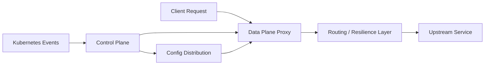
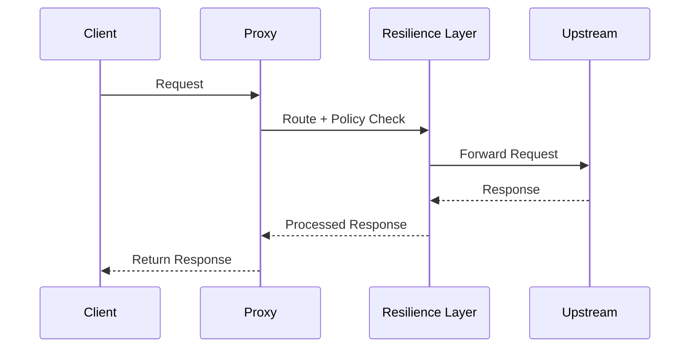
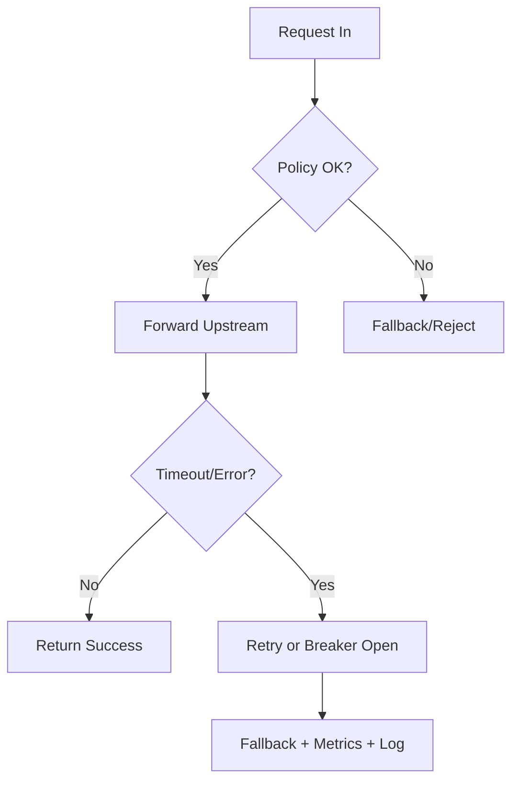

# Architecture and Request Flow（模板）

## 1. 文档信息

- 主题：<填写主题名称>
- 作者：<填写姓名>
- 日期：<YYYY-MM-DD>
- 版本：v0.1
- 状态：Draft / Review / Final

## 2. 背景与问题定义

### 2.1 背景

- 当前系统目标：<一句话说明系统目标>
- 业务场景：<描述主要使用场景>
- 当前痛点：<列出 2-3 个痛点>

### 2.2 问题定义

- 要解决的问题：<明确问题边界>
- 非目标：<明确不在本次解决范围的内容>

## 3. 架构总览

### 3.1 组件清单

- 控制面：<组件名 + 职责>
- 数据面：<组件名 + 职责>
- 存储/缓存：<组件名 + 职责>
- 依赖系统：<K8s API、Webhook、Metric 等>

### 3.2 架构图（必填）

> 替换为项目真实组件；箭头表示配置流和请求流。

### 3.3 模块职责边界

- 控制面负责：<配置发现、下发、一致性收敛等>
- 数据面负责：<转发、熔断、重试、负载均衡等>
- 边界约束：<谁不做什么，避免职责重叠>

## 4. 请求主流程（Happy Path）

### 4.1 请求路径说明

1. 客户端请求进入 <入口组件>
2. <鉴权/路由> 决策
3. <熔断/重试/超时> 策略执行
4. 请求转发到 <目标服务>
5. 返回响应并上报指标

### 4.2 时序图（必填）

## 5. 配置与状态流

### 5.1 配置产生与下发

- 配置来源：<CRD/ConfigMap/代码静态配置>
- 下发方式：<推/拉、全量/增量>
- 生效策略：<立即生效/平滑生效>

### 5.2 状态一致性策略

- 幂等键：<如何定义>
- 冲突处理：<新旧版本覆盖规则>
- 重复/乱序事件处理：<处理策略>
- 最终一致性收敛条件：<何时视为收敛>

## 6. 异常路径与容错设计

### 6.1 关键失败模式

- 上游超时：<处理策略>
- 下游不可用：<熔断/降级策略>
- 配置下发失败：<重试与补偿>
- 控制面不可用：<对数据面的影响与兜底>

### 6.2 失败路径图（建议）

## 7. 可观测性与排障入口

### 7.1 指标（Metrics）

- 成功率：<metric name>
- 延迟分位：<P50/P95/P99 metric>
- 错误率：<metric name>
- 重试/熔断状态：<metric name>

### 7.2 日志（Logs）

- 请求链路日志：<关键字段>
- 事件处理日志：<关键字段>
- 错误日志分级：INFO/WARN/ERROR

### 7.3 告警（Alerts）

- 告警规则：<阈值 + 持续时间>
- 告警分级：P0 / P1 / P2
- 排障入口：<先看什么指标，再看什么日志>

## 8. 性能与容量（可选但建议）

- 关键容量指标：QPS、并发连接、CPU、内存
- 基线数据：<填写压测基线>
- 瓶颈位置：<CPU/锁竞争/队列积压>
- 扩容建议：<阈值 + 扩容动作>

## 9. 风险与回滚

- 上线风险：<列出主要风险>
- 开关策略：<feature flag / 灰度策略>
- 回滚条件：<触发阈值>
- 回滚步骤：<具体操作步骤>

## 10. 验收标准（Definition of Done）

- 功能验收：<通过条件>
- 稳定性验收：<错误率/恢复时间阈值>
- 性能验收：<延迟/QPS 阈值>
- 可运维验收：<告警与排障链路可用>

## 11. 面试讲解提纲（5-8 分钟）

1. 问题背景：为什么要做这套架构
2. 方案对比：为什么选当前方案而不是备选方案
3. 关键取舍：一致性、可用性、复杂度怎么平衡
4. 故障案例：一次真实失败如何定位和修复
5. 结果与优化：数据结果和下一步计划

## 12. 关联代码与配置（填写实际路径）

- 控制面入口：<path>
- 数据面入口：<path>
- 关键策略实现：<path>
- 部署配置：<path>
- 指标与监控：<path>

## 13. 变更记录

- v0.1：初始化模板
