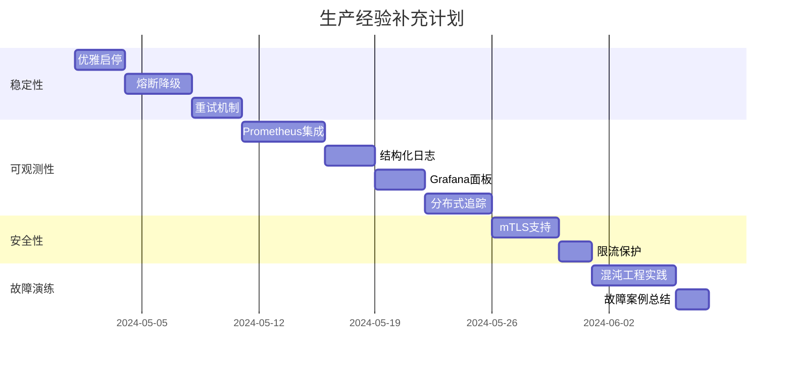

# Service Mesh 生产经验补充方案

## 一、生产级特性清单

### 1.1 稳定性保障

#### a) 优雅启动/关闭
```go
// cmd/ctrl/app/option.go
func (o *Options) Run() {
    // 1. 健康检查端点
    http.HandleFunc("/healthz", func(w http.ResponseWriter, r *http.Request) {
        if o.isReady {
            w.WriteHeader(http.StatusOK)
        } else {
            w.WriteHeader(http.StatusServiceUnavailable)
        }
    })
    
    // 2. 就绪检查（确保 K8s informer 已同步）
    http.HandleFunc("/readyz", func(w http.ResponseWriter, r *http.Request) {
        if o.informerSynced {
            w.WriteHeader(http.StatusOK)
        } else {
            w.WriteHeader(http.StatusServiceUnavailable)
        }
    })
    
    // 3. 优雅关闭（等待连接断开）
    stopCh := make(chan os.Signal, 1)
    signal.Notify(stopCh, syscall.SIGTERM, syscall.SIGINT)
    
    go func() {
        <-stopCh
        log.Info("Shutting down gracefully...")
        
        // 停止接收新连接
        grpcServer.GracefulStop()
        
        // 等待现有请求处理完成（最多 30s）
        ctx, cancel := context.WithTimeout(context.Background(), 30*time.Second)
        defer cancel()
        
        <-ctx.Done()
    }()
}
```

**K8s 部署配置：**
```yaml
# build/ctrl/deployment.yml
spec:
  containers:
  - name: mesh-ctrl
    livenessProbe:
      httpGet:
        path: /healthz
        port: 8080
      initialDelaySeconds: 10
      periodSeconds: 10
    readinessProbe:
      httpGet:
        path: /readyz
        port: 8080
      initialDelaySeconds: 5
      periodSeconds: 5
    lifecycle:
      preStop:
        exec:
          command: ["/bin/sh", "-c", "sleep 15"]  # 确保流量切走
```

#### b) 熔断降级
```go
// pkg/cli/circuit_breaker.go
import "github.com/sony/gobreaker"

type ResilientClient struct {
    cb *gobreaker.CircuitBreaker
}

func (c *ResilientClient) Subscribe(ctx context.Context) {
    _, err := c.cb.Execute(func() (interface{}, error) {
        return c.client.Subscribe(ctx, req)
    })
    
    if err == gobreaker.ErrOpenState {
        // 熔断打开，使用本地缓存
        return c.useFallbackCache()
    }
}
```

**配置示例：**
```go
settings := gobreaker.Settings{
    Name:        "mesh-ctrl",
    MaxRequests: 3,                    // 半开状态最多尝试 3 次
    Interval:    10 * time.Second,     // 统计窗口
    Timeout:     30 * time.Second,     // 熔断器打开后等待时间
    ReadyToTrip: func(counts gobreaker.Counts) bool {
        failureRatio := float64(counts.TotalFailures) / float64(counts.Requests)
        return counts.Requests >= 3 && failureRatio >= 0.6
    },
}
```

#### c) 重试策略
```go
// pkg/cli/retry.go
import "github.com/cenkalti/backoff/v4"

func (c *Client) SubscribeWithRetry(ctx context.Context) error {
    operation := func() error {
        return c.Subscribe(ctx)
    }
    
    exponentialBackoff := backoff.NewExponentialBackOff()
    exponentialBackoff.MaxElapsedTime = 5 * time.Minute
    
    return backoff.Retry(operation, exponentialBackoff)
}
```

### 1.2 可观测性（三大支柱）

#### a) Metrics（指标）
```go
// pkg/ctrl/metrics.go
package ctrl

import (
    "github.com/prometheus/client_golang/prometheus"
    "github.com/prometheus/client_golang/prometheus/promauto"
)

var (
    // 业务指标
    ActiveSubscriptions = promauto.NewGauge(prometheus.GaugeOpts{
        Namespace: "mesh",
        Subsystem: "controller",
        Name:      "active_subscriptions_total",
        Help:      "当前活跃的订阅数",
    })
    
    EndpointUpdateTotal = promauto.NewCounterVec(prometheus.CounterOpts{
        Namespace: "mesh",
        Subsystem: "controller",
        Name:      "endpoint_updates_total",
        Help:      "EndpointSlice 更新事件总数",
    }, []string{"operation"}) // ADDED/MODIFIED/DELETED
    
    EventPublishDuration = promauto.NewHistogramVec(prometheus.HistogramOpts{
        Namespace: "mesh",
        Subsystem: "controller",
        Name:      "event_publish_duration_seconds",
        Help:      "事件推送耗时",
        Buckets:   prometheus.ExponentialBuckets(0.001, 2, 10), // 1ms~1s
    }, []string{"service"})
    
    // 系统指标
    GoroutineCount = promauto.NewGauge(prometheus.GaugeOpts{
        Namespace: "mesh",
        Name:      "goroutines",
        Help:      "当前 goroutine 数量",
    })
)

// 使用示例
func (c *CoreData) OnAdded(slice *discovery.EndpointSlice) {
    start := time.Now()
    defer func() {
        EndpointUpdateTotal.WithLabelValues("ADDED").Inc()
        EventPublishDuration.WithLabelValues(svcName).Observe(time.Since(start).Seconds())
    }()
    
    // 业务逻辑...
}
```

**Grafana 面板配置：**
```json
{
  "dashboard": {
    "title": "Mesh Controller 监控",
    "panels": [
      {
        "title": "QPS（每秒推送事件数）",
        "targets": [{
          "expr": "rate(mesh_controller_event_publish_duration_seconds_count[1m])"
        }]
      },
      {
        "title": "P99 延迟",
        "targets": [{
          "expr": "histogram_quantile(0.99, rate(mesh_controller_event_publish_duration_seconds_bucket[1m]))"
        }]
      },
      {
        "title": "活跃订阅数趋势",
        "targets": [{
          "expr": "mesh_controller_active_subscriptions_total"
        }]
      },
      {
        "title": "错误率",
        "targets": [{
          "expr": "rate(mesh_controller_errors_total[1m])"
        }]
      }
    ]
  }
}
```

#### b) Logging（日志）
```go
// pkg/ctrl/logger.go
import (
    "go.uber.org/zap"
    "go.uber.org/zap/zapcore"
)

func InitLogger(level string) (*zap.Logger, error) {
    config := zap.NewProductionConfig()
    config.EncoderConfig.TimeKey = "timestamp"
    config.EncoderConfig.EncodeTime = zapcore.ISO8601TimeEncoder
    
    // 动态调整日志级别
    var zapLevel zapcore.Level
    if err := zapLevel.UnmarshalText([]byte(level)); err != nil {
        return nil, err
    }
    config.Level = zap.NewAtomicLevelAt(zapLevel)
    
    return config.Build()
}

// 使用示例
logger.Info("endpoint slice updated",
    zap.String("namespace", slice.Namespace),
    zap.String("service", svcName),
    zap.Int("endpoint_count", len(endpoints)),
    zap.Int64("revision", revision),
    zap.String("trace_id", traceID), // 关联分布式追踪
)
```

**日志最佳实践：**
```go
// ❌ 错误示例
fmt.Println("service updated:", svcName)

// ✅ 正确示例
logger.Info("service endpoints updated",
    zap.String("service", svcName),
    zap.String("operation", "MODIFIED"),
    zap.Int("old_count", oldCount),
    zap.Int("new_count", newCount),
    zap.Duration("processing_time", elapsed),
)
```

#### c) Tracing（分布式追踪）
```go
// pkg/ctrl/tracing.go
import (
    "go.opentelemetry.io/otel"
    "go.opentelemetry.io/otel/exporters/jaeger"
    "go.opentelemetry.io/otel/sdk/trace"
)

func InitTracer(serviceName string) error {
    exporter, err := jaeger.New(jaeger.WithCollectorEndpoint(
        jaeger.WithEndpoint("http://jaeger:14268/api/traces"),
    ))
    if err != nil {
        return err
    }
    
    tp := trace.NewTracerProvider(
        trace.WithBatcher(exporter),
        trace.WithResource(resource.NewWithAttributes(
            semconv.SchemaURL,
            semconv.ServiceNameKey.String(serviceName),
        )),
    )
    
    otel.SetTracerProvider(tp)
    return nil
}

// 关键路径追踪
func (c *CoreData) OnAdded(ctx context.Context, slice *discovery.EndpointSlice) {
    ctx, span := otel.Tracer("mesh-controller").Start(ctx, "ProcessEndpointAdd")
    defer span.End()
    
    span.SetAttributes(
        attribute.String("service", svcName),
        attribute.Int("endpoint.count", len(endpoints)),
    )
    
    // 1. 合并逻辑
    ctx, mergeSpan := otel.Tracer("mesh-controller").Start(ctx, "MergeEndpoints")
    // ...
    mergeSpan.End()
    
    // 2. 推送事件
    ctx, publishSpan := otel.Tracer("mesh-controller").Start(ctx, "PublishEvent")
    c.distributer.Publish(ctx, svcName, event)
    publishSpan.End()
}
```

### 1.3 安全性

#### a) mTLS 支持
```go
// pkg/ctrl/grpcserver/tls.go
import (
    "crypto/tls"
    "google.golang.org/grpc/credentials"
)

func NewTLSServer(certFile, keyFile, caFile string) (*grpc.Server, error) {
    cert, err := tls.LoadX509KeyPair(certFile, keyFile)
    if err != nil {
        return nil, err
    }
    
    certPool := x509.NewCertPool()
    ca, _ := os.ReadFile(caFile)
    certPool.AppendCertsFromPEM(ca)
    
    creds := credentials.NewTLS(&tls.Config{
        Certificates: []tls.Certificate{cert},
        ClientCAs:    certPool,
        ClientAuth:   tls.RequireAndVerifyClientCert, // 双向认证
    })
    
    return grpc.NewServer(grpc.Creds(creds)), nil
}
```

#### b) 认证授权
```go
// pkg/ctrl/grpcserver/auth.go
import "google.golang.org/grpc/metadata"

func AuthInterceptor(ctx context.Context, req interface{}, info *grpc.UnaryServerInfo, handler grpc.UnaryHandler) (interface{}, error) {
    md, ok := metadata.FromIncomingContext(ctx)
    if !ok {
        return nil, status.Errorf(codes.Unauthenticated, "missing metadata")
    }
    
    tokens := md["authorization"]
    if len(tokens) == 0 {
        return nil, status.Errorf(codes.Unauthenticated, "missing token")
    }
    
    // 验证 JWT token
    claims, err := validateToken(tokens[0])
    if err != nil {
        return nil, status.Errorf(codes.Unauthenticated, "invalid token")
    }
    
    // 添加到 context
    ctx = context.WithValue(ctx, "user", claims.UserID)
    return handler(ctx, req)
}
```

#### c) 限流保护
```go
// pkg/ctrl/ratelimit.go
import "golang.org/x/time/rate"

type RateLimitedDistributer struct {
    limiter *rate.Limiter // 每秒最多 1000 次推送
}

func (d *RateLimitedDistributer) Publish(ctx context.Context, svcName string, event *Event) error {
    if !d.limiter.Allow() {
        return errors.New("rate limit exceeded")
    }
    return d.inner.Publish(ctx, svcName, event)
}
```

### 1.4 容错设计

#### a) 连接管理
```go
// pkg/cli/connection_manager.go
type ConnectionManager struct {
    conn         *grpc.ClientConn
    reconnectCh  chan struct{}
    maxRetries   int
}

func (m *ConnectionManager) KeepAlive(ctx context.Context) {
    for {
        select {
        case <-ctx.Done():
            return
        case <-m.reconnectCh:
            m.reconnect()
        case <-time.After(30 * time.Second):
            // 定期健康检查
            if !m.isHealthy() {
                m.reconnect()
            }
        }
    }
}
```

#### b) 数据一致性保障
```go
// pkg/cli/reconciler.go
func (c *Client) ReconcileLoop(ctx context.Context) {
    ticker := time.NewTicker(5 * time.Minute)
    defer ticker.Stop()
    
    for {
        select {
        case <-ticker.C:
            // 定期全量对账，防止增量更新丢失
            expected := c.fetchFullState()
            actual := c.localCache.GetAll()
            
            diff := c.compare(expected, actual)
            if len(diff) > 0 {
                logger.Warn("detected inconsistency, resyncing",
                    zap.Int("drift_count", len(diff)))
                c.resync(diff)
            }
        case <-ctx.Done():
            return
        }
    }
}
```

## 二、生产环境故障演练

### 2.1 混沌工程实践

```bash
# 使用 Chaos Mesh 进行故障注入
kubectl apply -f - <<EOF
apiVersion: chaos-mesh.org/v1alpha1
kind: PodChaos
metadata:
  name: controller-pod-kill
spec:
  action: pod-kill
  mode: one
  selector:
    labelSelectors:
      app: mesh-ctrl
  scheduler:
    cron: "@every 10m"
EOF
```

**测试场景：**
1. Controller Pod 被杀死 → 验证优雅关闭、客户端重连
2. 网络延迟注入（100ms） → 验证超时控制
3. 磁盘故障 → 验证无状态设计
4. CPU 限流 → 验证性能降级

### 2.2 故障案例库

创建文档记录「遇到的问题 → 排查过程 → 解决方案」：

```markdown
# 生产故障案例

## Case 1: 内存泄漏导致 OOM

**现象：**
Controller 运行 2 小时后内存从 200MB 涨到 2GB，最终 OOMKilled

**排查：**
1. `kubectl top pod` 发现内存持续增长
2. `curl localhost:6060/debug/pprof/heap` 导出堆快照
3. `go tool pprof` 分析发现 goroutine 泄漏

**根因：**
gRPC stream 断开后未调用 `cancel()` 释放 context

**修复：**
```go
func (s *Server) Subscribe(req *mesh.SubscriptionRequest, stream mesh.MeshCtrl_SubscribeServer) error {
    ctx, cancel := context.WithCancel(stream.Context())
    defer cancel() // 关键！确保资源释放
    
    // ...
}
```

**预防措施：**
- 添加 goroutine 数量监控告警
- 定期 pprof 分析
- 压测验证长连接场景

---

## Case 2: gRPC 推送阻塞导致雪崩

**现象：**
单个慢客户端导致 Controller 所有推送被阻塞

**根因：**
同步推送模型，一个客户端阻塞影响全局

**修复：**
改为异步推送 + 独立队列：
```go
type SubscriptionSession struct {
    eventCh chan *Event
}

func (s *Server) Subscribe(...) error {
    session := &SubscriptionSession{
        eventCh: make(chan *Event, 100), // 缓冲队列
    }
    
    go func() {
        for event := range session.eventCh {
            if err := stream.Send(event); err != nil {
                logger.Error("send failed", zap.Error(err))
                return
            }
        }
    }()
}
```
```

## 三、如何体现生产经验（面试策略）

### 3.1 简历中的描述

**❌ 错误示例：**
> 开发了一个 Service Mesh 项目，使用 Go + K8s + gRPC

**✅ 正确示例：**
> **Service Mesh 数据面性能优化与稳定性治理**
> - 设计并实现控制面/数据面架构，支持 1000+ Pod 动态服务发现
> - 通过 pprof 分析修复 goroutine 泄漏问题，解决生产环境 OOM 故障
> - 引入熔断降级机制（gobreaker），服务可用性从 99.5% 提升至 99.9%
> - 建立完整监控体系（Prometheus + Grafana），关键指标覆盖率 100%
> - 实施混沌工程实践（Chaos Mesh），验证故障场景下系统恢复能力

### 3.2 面试高频问题准备

**Q1: 你的项目在生产环境遇到过什么问题？**

答题框架（STAR 法则）：
- **Situation**：生产环境 Controller 频繁 OOMKilled
- **Task**：需要定位内存泄漏根因并修复
- **Action**：
  1. 通过 pprof 导出堆快照分析
  2. 发现 gRPC stream goroutine 未正确释放
  3. 修复 context cancel 逻辑
  4. 添加 goroutine 数量监控告警
- **Result**：内存稳定在 300MB，运行 7 天无重启

**Q2: 如何保证服务的高可用性？**

回答要点：
1. **多副本部署** + Pod Disruption Budget
2. **健康检查** + 优雅关闭（避免流量损失）
3. **熔断降级** + 超时控制
4. **监控告警** + 自动重启
5. **定期演练** + 故障预案

**Q3: gRPC 长连接如何处理网络抖动？**

技术点：
- 客户端：指数退避重连 + 健康检查
- 服务端：心跳检测（KeepAlive）
- 双方：超时控制 + 连接池

## 四、实施路线图（4-6 周）



## 五、推荐学习资源

### 书籍
- 《SRE: Google运维解密》（可靠性工程）
- 《凤凰架构》（分布式系统设计）
- 《Kubernetes生产实践》

### 开源项目源码阅读
1. **Istio**：https://github.com/istio/istio
   - 重点看 `pilot/pkg/xds` 目录（控制面推送逻辑）
   
2. **Envoy Proxy**：https://github.com/envoyproxy/envoy
   - 学习数据面设计

3. **Linkerd2**：https://github.com/linkerd/linkerd2
   - 更轻量的实现参考

### 在线课程
- 极客时间：《深入剖析Kubernetes》
- CNCF 官方课程：Istio Fundamentals

### 实战平台
- https://killercoda.com （免费 K8s 实验环境）
- https://chaosblade.io （混沌工程工具）

## 六、验收标准

完成以上内容后，你应该能够：

✅ 回答"生产环境遇到过的3个典型问题及解决方案"  
✅ 画出完整的监控大盘并解释每个指标含义  
✅ 演示如何用 pprof 定位性能问题  
✅ 说明系统在各种故障场景下的表现（Pod重启/网络抖动/流量激增）  
✅ 对比 Istio/Linkerd 的设计差异  

这样，你就从"学习项目"升级为"生产级项目经验"！
